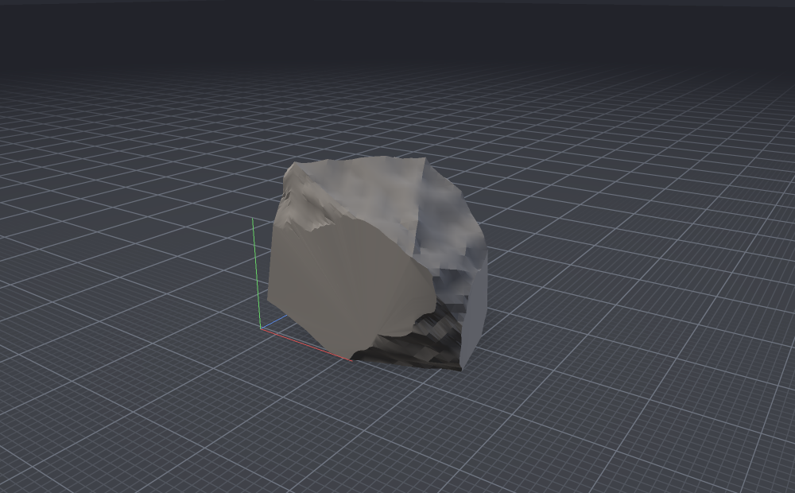

# model-renderer

A small OpenGL 3.3 model viewer in C++: assimp reads the file, and the
renderer draws it with the shading from
[Rock-Generator](https://github.com/DentonW/Rock-Generator) — the same
three-point light rig, the same ground plane and grid, the same supersampled
offscreen buffer. That renderer was a tkinter widget in Python; this is the
same picture with any model assimp can open in front of it, animated ones
included.

```
model-renderer sponza.gltf
```



The shaders and camera are line-for-line ports. With the same rock exported
from Rock-Generator as glb, obj, fbx or ply, a frame from this program matches
the Python viewport's to within a few pixels along the axis lines. The one
deliberate difference is the grid: here its cells are a fixed real size,
10 cm by default with a stronger line every metre, so the grid shows how
big the model actually is. Its lines are also a little heavier
(`--grid-size`, `--grid-width`).

## Building

CMake and a C++17 compiler, nothing else. [CPM](https://github.com/cpm-cmake/CPM.cmake)
(vendored in `cmake/`) fetches and builds the three dependencies as part of
the configure step:

| | |
|---|---|
| [glfw](https://github.com/glfw/glfw) 3.4 | window, GL context, input |
| [assimp](https://github.com/assimp/assimp) 6.0.5 | model import |
| [stb](https://github.com/nothings/stb) | texture decoding, PNG screenshots |

```bash
cmake -S . -B build
cmake --build build --config Release
```

The binary lands in `build/bin`. The first configure clones assimp and builds
every importer it ships with, which takes a few minutes; later builds only
compile this project. Setting `CPM_SOURCE_CACHE` to a directory shares those
clones between build trees:

```bash
cmake -S . -B build -DCPM_SOURCE_CACHE=~/.cache/cpm
```

There is no GL loader dependency. `src/gl33.h` declares the sixty-odd entry
points this program uses and resolves them through `glfwGetProcAddress`, which
avoids glad's and gl3w's Python-at-configure-time requirement.

## Controls

| | |
|---|---|
| left-drag | orbit |
| right-drag or middle-drag | pan |
| wheel | zoom |
| double-click | frame the model |
| `F` | frame the model |
| `W` | wireframe: over the surface, then alone, then off |
| `S` | flat shading |
| `N` | face normals: a line out of each triangle, as long as the triangle is large |
| `G` | grid |
| `B` | ground plane and axis gnomon |
| `T` | textures |
| `V` | vertex colours (off shows the material colour) |
| `C` | back-face culling |
| `Space` | play / pause the animation |
| `[` `]` | previous / next animation clip, with the rest pose as one stop on the way round |
| `P` | screenshot into the working directory |
| `R` | reload the file from disk |
| `Esc` | quit |

Dropping a file onto the window loads it, so the window can be opened empty
and fed afterwards.

## Options

```
model-renderer [options] [model-file]

  --size WxH         window size (default 1280x800)
  --ss N             supersampling factor, 1-4 (default 2)
  --fov DEG          vertical field of view (default 38)
  --yaw DEG          starting view: angle around the model (default 34)
  --pitch DEG        starting view: angle above the ground, -83 to 83 (default 20)
  --flat             start with flat shading
  --wire             start with the wireframe over the surface
  --wire-only        start with the wireframe alone
  --normals          start with the face normals shown
  --no-ground        hide the ground plane and axis gnomon
  --no-grid          keep the ground, drop the grid lines
  --grid-size LEN    grid cell size: 10cm, 1m, 1ft and so on (default 10cm);
                     every tenth line is drawn stronger
  --grid-width PX    grid line width in window pixels (default 1)
  --units U          what one unit in the file is: m, cm, mm, km, in, ft;
                     by default read from the file where it says
  --no-cull          draw back faces too, for inconsistent winding
  --no-textures      shade with material colours only
  --albedo R,G,B     colour for models with no colour of their own
  --exposure X       overall brightness multiplier
  --crease DEG       smoothing limit for meshes that arrive without normals
  --z-up             rotate a Z-up model into this Y-up world
  --anim N           animated models: start on clip N, counting from 1;
                     0 shows the rest pose (default 1)
  --time SEC         animated models: start SEC seconds into the clip
  --screenshot FILE  render one frame to a PNG and exit
```

`--screenshot` opens no visible window, which makes it usable for turntables,
animation frames and checking a model from a script:

```bash
model-renderer --size 1600x1200 --ss 3 --screenshot rock.png rock.obj
model-renderer --yaw 90 --pitch -30 --screenshot underside.png rock.obj
model-renderer --anim 2 --time 0.5 --screenshot stride.png character.glb
```

## Animation

An animated model starts playing its first clip as soon as it loads, and
loops. The console lists the clips with their lengths; `[` and `]` move
between them and `Space` pauses. All three kinds of animation assimp
delivers are played:

- **Skeletal (skinned)** — characters and creatures, each vertex following
  up to four bones.
- **Node animation** — rigid parts moving on their own: wheels, doors, a
  whole object travelling.
- **Morph targets** (blend shapes) — faces, and anything else that deforms
  without bones.

A static scene is baked at load, as before. An animated one keeps each mesh
in its own space, and every vertex gets up to four joints and weights in a
second vertex buffer. Each frame, the clip's keyframes are sampled (linear
for position and scale, slerp for rotation), the node hierarchy is walked to
world transforms, and one matrix per joint goes to the GPU in a buffer
texture for the vertex shader to blend. Rigid parts take the same path as a
single joint at full weight. Morph targets are blended on the CPU, ahead of
skinning, and written into their stretch of the vertex buffer. The wireframe
follows the pose.

The ground sits at the lowest point any vertex reaches in the rest pose or
anywhere in any clip, and the camera frames the whole range of motion, so
nothing sinks into the floor or leaves the frame mid-animation. The contact
shadow follows the model as it moves. Frames are only drawn continuously
while something is playing; paused or static, the viewport costs nothing.

Not played: assimp's per-vertex keyframe animation, which only a few old game
formats use. A skinned mesh is taken to be unmirrored in its rest pose.

## How it draws

Four programs, all in `src/shaders.h`, carried over from the Python, and a
fifth for normals:

- **background** — a vertical gradient on one oversized triangle.
- **ground** — a single upward-facing quad at the bottom of the model's
  bounding box, shaded analytically: a radial contact shadow under the model,
  a grid of fixed-size cells, in two weights (every tenth line stronger),
  with lines held at a constant width in window pixels (via `fwidth`) at any
  angle, and a fade to the horizon colour. Where each set of cells shrinks
  to a few pixels (under a very large model, or toward the
  horizon) the lines fade out rather than turning to moiré. The quad is
  back-face culled, so it disappears when the camera goes below it.
- **mesh** — key light, fill light, hemisphere ambient (sky above, bounce
  below) and a rim term. Flat shading takes the face normal from
  `dFdx`/`dFdy`, so it needs no second copy of the geometry. For animated
  models its vertex shader also does the skinning.
- **line** — the wireframe (dark over the surface, light on its own) and the
  axis gnomon.
- **normals** — a geometry shader turns each triangle into a line from its
  centre along its face normal. The line is as long as the side of a square
  of the triangle's area. It works from the triangle as posed, so it follows
  animation, and takes the normal from the winding, as culling does. That
  makes a triangle wound the wrong way easy to find. With culling on it
  leaves a hole, with its normal visible through it pointing into the model;
  with culling off it is the one face without a line.

Everything is drawn into an offscreen buffer at 2x the window resolution with
a 24-bit depth buffer and blitted down, which antialiases the silhouettes and
keeps flat faces out of z-fighting.

The scene assimp returns is flattened at load into one vertex buffer and one
index buffer, drawn as a list of ranges, one per mesh. For a static scene the
node transforms are baked into the vertices (normals through the cofactor
matrix, with winding and normals both corrected where a transform mirrors);
an animated one is posed each frame instead, as above. The wireframe's
unique-edge buffer is built the first time the overlay is switched on, since
it costs a sort over every triangle corner.

## Notes on models

- **Colour.** A mesh's vertex colours, when it has them, are its albedo, as
  they were in the rock generator. Its exporters also write the average
  vertex colour into the material, as a fallback for software that ignores
  vertex colours; multiplying the two would darken every rock. `V` switches to
  the material colour instead. A mesh without vertex colours uses its
  material's diffuse or base colour, and either way the diffuse texture
  multiplies on top. Where the file names no colour at all, the mesh is drawn
  in the `--albedo` grey. That includes the stand-in materials assimp invents
  for files that have none. It also covers pure-black materials, which is what
  exporters write when they can't translate the real shader (Maya's Arnold
  materials come out of its OBJ exporter that way). Vertex-colour layers that
  are solid black or solid white are placeholders and are ignored.
- **Maya materials.** Maya's Standard Surface and Arnold materials, the
  default in current Maya, keep their colour in Maya's own FBX properties.
  Assimp passes these through untranslated, and the standard colour fields
  beside them are empty. That colour (`Maya|baseColor`, scaled by the base
  weight) is read directly and takes priority. Maya's OBJ exporter can't
  carry it at all and writes black, so export such models as FBX.
- **Colour space.** glTF, and Maya's material colours, store colour as linear
  values; they are converted to sRGB on load, since that is the space the
  shading works in. Texels are used as authored (image files are already
  sRGB).
- **Normals.** Whatever the file provides is kept. Meshes that arrive without
  normals get smooth ones, with `--crease` as the limit: edges sharper than
  that stay sharp. The Python split hard edges itself at the same point in the
  pipeline; assimp's `GenSmoothNormals` does the same job here.
- **Textures.** The diffuse/base-colour map is loaded, including textures
  embedded in `.glb` and `.fbx`. Texels are used as authored, in the same
  space as the vertex colours, rather than being converted to linear — that is
  what keeps this renderer's output matching the Python's. Materials with an
  alpha channel are cut out at 0.5, so foliage and fences keep their shape.
- **Orientation.** Y-up is assumed. `--z-up` rotates a Z-up file (much CAD,
  some Blender exports) into place.
- **Units and scale.** The grid is a ruler: its cells are a fixed real size
  (`--grid-size`, 10 cm by default), with every tenth line drawn stronger,
  so a model's size reads straight off it.
  That needs the file's units, which are taken from the file where it gives
  them: glTF is metres by definition, and FBX records its unit (usually
  centimetres). Collada is converted to metres by assimp and Blender works in
  metres. STL and 3MF are assumed to be millimetres, as 3-D printing files
  usually are, and anything else metres; `--units` overrides all of this. The
  console prints the size in real units and says where the unit came from.
  For an animated model it gives the rest pose's size and, separately, the
  space the animation moves through.
- **Framing.** Everything else scales with the model: the camera frames its
  bounding sphere, and the clipping planes, zoom range, ground, shadow and
  axis lengths follow its size. The same model at a billionth of the size or
  a billion times it is framed identically. What changes is the grid behind
  it. With the defaults, framing a model more than a few metres across makes
  the 10 cm cells too small to draw, and they fade out until you zoom in.
  The 1 m lines carry on until the model is a few tens of metres across, and
  a model much under a centimetre sits inside a single cell. `--grid-size`
  suits the grid to either end: `--grid-size 1m` gives 1 m and 10 m lines for
  buildings and vehicles, say.
- **Far from the origin.** CAD, survey and scan data are often placed
  thousands of kilometres out, where a single-precision float can't tell
  apart points closer than half a unit. Node transforms are composed in
  double, and a model more than a hundred times its own size from the origin
  is moved back near it before anything is rounded. The move is a whole
  number of grid cells, so the grid lines stay where they were on the model.
  An offset carried by node transforms is then drawn exactly. One written
  into the vertex coordinates themselves has already been rounded by assimp
  on import, so detail finer than about 1/16 unit is lost at a million units
  out, and finer than half a unit at five million.
